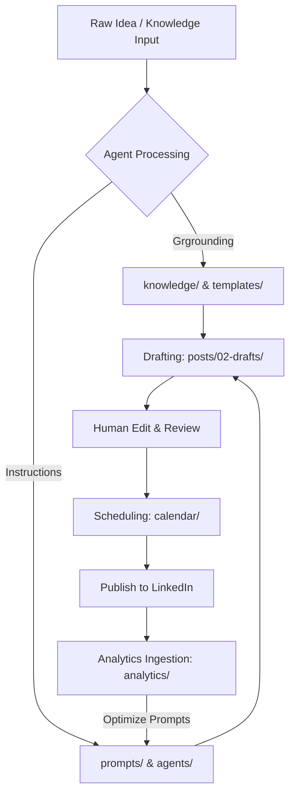

# 🚀 LinkedIn Content OS

> A structured, AI-agent-native operating system designed to synthesize authentic, high-signal LinkedIn content that captures your unique voice, experience, and opinions.

📄 **Core Navigation**:
* See [INDEX.md](file:///home/abdulrahman/Projects/linkedin-content-os/INDEX.md) for a map of all files in this OS.
* See [WORKFLOW.md](file:///home/abdulrahman/Projects/linkedin-content-os/WORKFLOW.md) to understand the ingestion-generation workflow.

---

## 🌟 Vision

The **LinkedIn Content OS** serves as a centralized, programmatic brain for AI agents to draft authentic, engaging, and authoritative LinkedIn content. Instead of generating generic, AI-sounding posts, this system anchors agents in a rich foundation of real-world stories, technical knowledge, project updates, personal opinions, and up-to-date research. 

By treating personal branding as an open-source engineering system, the LinkedIn Content OS enables agents to act as high-fidelity extensions of your own intellect, ensuring every post sounds exactly like you—backed by actual substance.

---

## 🎯 Goals

- **Zero-Shot Authenticity**: Ground AI agents in personal style guidelines, tone matrices, and a narrative database to prevent generic output.
- **High-Signal Content**: Systematically transform raw projects, research papers, and technical knowledge into structured, educational content.
- **Agent-First Architecture**: Maintain a clean, machine-readable structure (`JSON`, `Markdown`, `YAML`) so AI agents can parse, search, and append data programmatically.
- **Scalable Content Operations**: Establish a standardized lifecycle from raw idea to scheduled post to performance analysis.

---

## 📂 Repository Structure

```text
linkedin-content-os/
├── agents/             # Prompts, config files, and orchestration scripts for AI agents
├── analytics/          # Performance metrics, audience insights, and historic post logs
├── assets/             # Images, graphics, and visual media used in posts
├── calendar/           # Content scheduler, publication pipeline, and active queues
├── ideas/              # Raw thoughts, voice memos, and unrefined content concepts
├── knowledge/          # The personal brain/databases (Stories, Tech, Opinions, Projects)
│   ├── opinions/       # Hot takes, philosophical beliefs, and industry perspectives
│   ├── projects/       # Portfolios, active builds, tech stack details, and case studies
│   ├── stories/        # Personal anecdotes, career milestones, failures, and wins
│   └── technical/      # Notes on architecture, programming, patterns, and deep dives
├── posts/              # Written content organized by stage (backlog, drafts, published)
│   ├── 01-backlog/
│   ├── 02-drafts/
│   └── 03-published/
├── prompts/            # System instructions, writing styles, and persona frameworks
├── research/           # Curated papers, trend reports, and deep-dive source material
└── templates/          # Proven hooks, structural formats, and layout patterns
```

---

## ⚙️ Workflow



1. **Ingest**: Add raw stories, project updates, or research notes to the [knowledge/](file:///home/abdulrahman/Projects/linkedin-content-os/knowledge) directory.
2. **Retrieve**: AI agents query the database (e.g., using Vector DB or semantic file search) for context relevant to a chosen topic.
3. **Generate**: Agents apply instructions from [prompts/](file:///home/abdulrahman/Projects/linkedin-content-os/prompts) and structures from [templates/](file:///home/abdulrahman/Projects/linkedin-content-os/templates) to write draft markdown files under [posts/02-drafts/](file:///home/abdulrahman/Projects/linkedin-content-os/posts).
4. **Approve & Publish**: You review and polish the draft. Once approved, the post moves to `posts/03-published/` and is queued in the `calendar/`.
5. **Analyze**: Engagement data is fed back into [analytics/](file:///home/abdulrahman/Projects/linkedin-content-os/analytics) to programmatically refine agent instructions.

---

## 📁 Folder Responsibilities

### 🤖 [agents/](file:///home/abdulrahman/Projects/linkedin-content-os/agents)
Houses orchestration files, agent config files (e.g., CrewAI, AutoGen, or Custom LLM scripts), and tool definitions. This is the executable engine of the repo.

### 📊 [analytics/](file:///home/abdulrahman/Projects/linkedin-content-os/analytics)
Stores performance tracking data (e.g., impressions, engagement rate, comments). Agents parse this folder to learn what topics and hooks perform best.

### 🧠 [knowledge/](file:///home/abdulrahman/Projects/linkedin-content-os/knowledge)
The core database of *you*. Divided into:
- **`stories/`**: Core narratives, career pivots, and raw human moments.
- **`technical/`**: Deep technical insights, coding paradigms, and systems engineering concepts.
- **`projects/`**: Case studies, architectures, and design logs of things you have built.
- **`opinions/`**: Bold views, contrarian industry thoughts, and professional philosophies.

### 📝 [posts/](file:///home/abdulrahman/Projects/linkedin-content-os/posts)
Manages the lifecycle of posts. Must always utilize Markdown with standard frontmatter schemas (containing metadata like category, status, keywords, target date).

### ⚡ [prompts/](file:///home/abdulrahman/Projects/linkedin-content-os/prompts)
Maintains system instructions, tone guidelines, formatting rules (e.g., "no emojis inside code snippets", "active voice only"), and few-shot examples.

---

## 🏷️ Naming Convention

To ensure AI agents can successfully browse, parse, and reference files, follow this strict naming schema:

### 1. File Names
- Use **kebab-case** only (e.g., `leveraging-k8s-cost-optimization.md`).
- Prefix post drafts with `YYYY-MM-DD-` to maintain chronological order in directories (e.g., `2026-07-25-avoid-microservice-hell.md`).

### 2. Frontmatter Schema (for Posts)
Every post in the `posts/` folder must include a YAML frontmatter header:
```yaml
---
title: "How I Optimised K8s Idle Costs by 40%"
date_created: 2026-07-24
target_publish_date: 2026-07-28
status: draft # [backlog, draft, review, published]
theme: cloud-infrastructure
keywords: [kubernetes, devops, cost-efficiency]
reference_stories: [stories/my-first-kubernetes-outage.md]
---
```

---

## 🤝 Contribution Guidelines

We treat this Content OS like code. If you are suggesting enhancements:
1. **Submit a Pull Request**: Follow the structure conventions strictly.
2. **Test your Markdown**: Ensure that internal file links use absolute paths (or workspace-relative paths) so parsers do not break.
3. **Verify Frontmatter**: All new files in `posts/` or `knowledge/` must validate against their respective schemas.

---

## 🗺️ Future Roadmap

- [ ] **Vector Search Integration**: Add a CLI script in `agents/` to index the `knowledge/` folder into a local ChromaDB/LanceDB instance.
- [ ] **Feedback Loop Automation**: Automate ingestion of LinkedIn exports (CSV) directly into the `analytics/` folder.
- [ ] **Multi-Agent Orchestration**: Implement a researcher-agent and a writer-agent flow using LangGraph.
- [ ] **Automatic Link Validation**: CI pipeline using GitHub Actions to check that all file links under `reference_stories:` and `reference_projects:` are valid.
