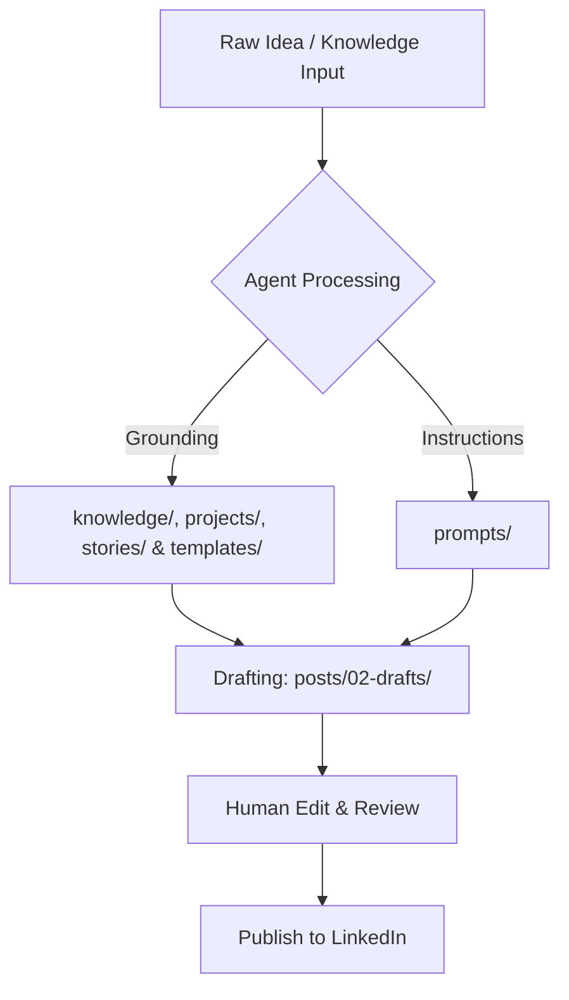

# 🚀 LinkedIn Content OS

> A structured, AI-agent-native operating system designed to synthesize authentic, high-signal LinkedIn content that captures your unique voice, experience, and opinions.

📄 **Core Navigation**:
* See [INDEX.md](file:///home/abdulrahman/Projects/linkedin-content-os/INDEX.md) for a map of all files in this OS.
* See [WORKFLOW.md](file:///home/abdulrahman/Projects/linkedin-content-os/WORKFLOW.md) to understand the ingestion-generation workflow.

---

## 🌟 Vision

The **LinkedIn Content OS** serves as a centralized, programmatic brain for AI agents to draft authentic, engaging, and authoritative LinkedIn content. Instead of generating generic, AI-sounding posts, this system anchors agents in a rich foundation of real-world stories, technical knowledge, project updates, personal opinions, and up-to-date research. 

By treating personal branding as an open-source engineering system, the LinkedIn Content OS enables agents to act as high-fidelity extensions of your own intellect, ensuring every post sounds exactly like you—backed by actual substance.

---

## 🎯 Goals

- **Zero-Shot Authenticity**: Ground AI agents in personal style guidelines, tone matrices, and a narrative database to prevent generic output.
- **High-Signal Content**: Systematically transform raw projects, research papers, and technical knowledge into structured, educational content.
- **Agent-First Architecture**: Maintain a clean, machine-readable structure (`JSON`, `Markdown`, `YAML`) so AI agents can parse, search, and append data programmatically.
- **Scalable Content Operations**: Establish a standardized lifecycle from raw idea to scheduled post to performance analysis.

---

## 📂 Repository Structure

```text
linkedin-content-os/
├── knowledge/          # Core profile, career, skills, goals, writing style, and raw resume
├── projects/           # Factual project case studies (formerly under knowledge/)
├── stories/            # Factual engineering anecdotes (formerly under knowledge/)
├── posts/              # Written content organized by stage (backlog, drafts, published)
├── prompts/            # System instructions and persona frameworks
├── research/           # Curated papers, trend reports, and deep-dive source material
└── templates/          # Proven hooks, structural formats, and layout patterns
```

---

## ⚙️ Workflow



1. **Ingest**: Add raw stories to [stories/](file:///home/abdulrahman/Projects/linkedin-content-os/stories), project updates to [projects/](file:///home/abdulrahman/Projects/linkedin-content-os/projects), or general profile info to [knowledge/](file:///home/abdulrahman/Projects/linkedin-content-os/knowledge).
2. **Retrieve**: AI agents query the database for context relevant to a chosen topic.
3. **Generate**: Agents apply instructions from [prompts/](file:///home/abdulrahman/Projects/linkedin-content-os/prompts) and structures from [templates/](file:///home/abdulrahman/Projects/linkedin-content-os/templates) to write draft markdown files under [posts/02-drafts/](file:///home/abdulrahman/Projects/linkedin-content-os/posts).
4. **Approve & Publish**: You review and polish the draft. Once approved, the post is published to LinkedIn and moved to `posts/03-published/` to keep history.

---

## 📁 Folder Responsibilities

### 🧠 [knowledge/](file:///home/abdulrahman/Projects/linkedin-content-os/knowledge)
The core database of *you*. Holds your profile, skills, career overview, goals, writing style guidelines, and raw resume context.

### 🚀 [projects/](file:///home/abdulrahman/Projects/linkedin-content-os/projects)
Detailed case studies, architectures, tech stacks, and design logs of things you have built.

### 📖 [stories/](file:///home/abdulrahman/Projects/linkedin-content-os/stories)
Core anecdotes, career pivots, and raw human engineering moments.

### 📝 [posts/](file:///home/abdulrahman/Projects/linkedin-content-os/posts)
Manages the lifecycle of posts. Utilizes Markdown with standard frontmatter schemas.

### ⚡ [prompts/](file:///home/abdulrahman/Projects/linkedin-content-os/prompts)
Maintains system instructions, tone guidelines, target audience profiles, and few-shot examples.

---

## 🏷️ Naming Convention

To ensure AI agents can successfully browse, parse, and reference files, follow this strict naming schema:

### 1. File Names
- Use **kebab-case** only (e.g., `leveraging-k8s-cost-optimization.md`).
- Prefix post drafts with `YYYY-MM-DD-` to maintain chronological order in directories (e.g., `2026-07-25-avoid-microservice-hell.md`).

### 2. Frontmatter Schema (for Posts)
Every post in the `posts/` folder must include a YAML frontmatter header:
```yaml
---
title: "How I Optimised K8s Idle Costs by 40%"
date_created: 2026-07-24
target_publish_date: 2026-07-28
status: draft # [backlog, draft, review, published]
theme: cloud-infrastructure
keywords: [kubernetes, devops, cost-efficiency]
reference_stories: [stories/my-first-kubernetes-outage.md]
---
```

---

## 🤝 Contribution Guidelines

We treat this Content OS like code. If you are suggesting enhancements:
1. **Submit a Pull Request**: Follow the structure conventions strictly.
2. **Test your Markdown**: Ensure that internal file links use standard file URLs so parsers do not break.
3. **Verify Frontmatter**: All new files in `posts/` or `knowledge/` must validate against their respective schemas.
