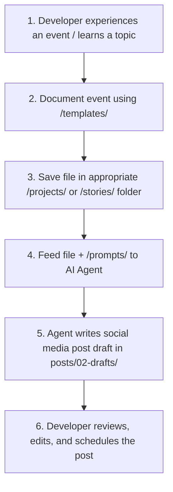

# ⚙️ Operations Workflow: LinkedIn Content OS

This document explains the workflow for a single developer using the **LinkedIn Content OS** to build a personal brand using AI agents (like Claude, ChatGPT, or Manus).

---

## 🔄 The Ingestion-Generation Cycle

---

## 🛠️ Step-by-Step Guide

### Step 1: Documenting Raw Knowledge (Developer)
When you build a project, fix an interesting bug, or form a strong technical opinion:
1. Go to [`templates/`](file:///home/abdulrahman/Projects/linkedin-content-os/templates) and copy the appropriate template.
2. Fill it out with raw facts, code snippets, and metrics.
3. Save the new markdown file under its respective folder:
   * Case studies go to [`projects/`](file:///home/abdulrahman/Projects/linkedin-content-os/projects)
   * Anecdotes/outages go to [`stories/`](file:///home/abdulrahman/Projects/linkedin-content-os/stories)
   * Hot takes/opinions and technical patterns can go directly under [`knowledge/`](file:///home/abdulrahman/Projects/linkedin-content-os/knowledge)

### Step 2: Running the Agent (Developer + AI)
Provide your AI agent (ChatGPT, Claude, or Manus) with the following context files:
1. Your core identity profile: [`knowledge/profile.md`](file:///home/abdulrahman/Projects/linkedin-content-os/knowledge/profile.md)
2. Your style parameters: [`knowledge/writing-style.md`](file:///home/abdulrahman/Projects/linkedin-content-os/knowledge/writing-style.md)
3. The raw knowledge document you created in Step 1.

**Prompt the Agent:**
> *"Using the identity guidelines in `profile.md` and the constraints in `writing-style.md`, read the project case study at `[path/to/my-file.md]` and generate three distinct social media posts using the formatting ideas listed at the bottom of the file. Save the drafts in `/posts/02-drafts/`."*

### Step 3: Human Review & Publishing (Developer)
1. Open the generated file in [`posts/02-drafts/`](file:///home/abdulrahman/Projects/linkedin-content-os/posts).
2. Review for authenticity, verify code blocks are correct, and clean up any wording that sounds slightly generic.
3. Once satisfied:
   * Publish it to LinkedIn.
   * Move the draft to `posts/03-published/` to keep a permanent history of what you have published.
